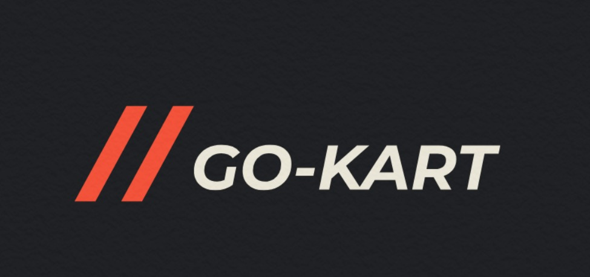

# Go Kart

## Qué es y cuál es su fin?

Go kart es un karting hecho a traves de materiales reutilizados, consta de un chasis prefabricado y de un motor ciclomotor que se encargara del encendido de nuestro karting

## Quiénes lo desarrollan?
Go Kart es un proyecto en proceso realizado por alumnos de la Escuela Secundaria IMPA de 7mo 2da Avionica.

## Integrantes

### Thiago Marques da Silva
    📷 Instagram: thiagosilvaa09
    📧 Email: thiagomds232@gmail.com
### Elias Zenobi
    📷 Instagram: zenobii.e
    📧 Email: zenobielias@gmail.com 
### Tomas Noval
    📷 Instagram: tomas.noval
    📧 Email: 

## Cómo contactarnos
Si tenes opiniones o dudas sobre el proyecto que nos puedan ayudar, no dudes en ponerte en contacto con nosotros:

    📧 Email: gokartgofast2@gmail.com
    🌐 Página Web: https://gokartgofast.github.io/
    📷 Instagram: gokart_2022
    